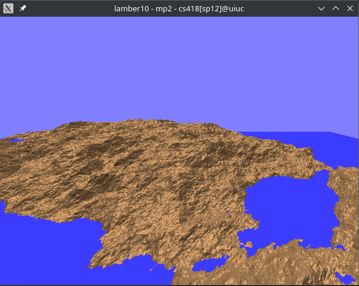
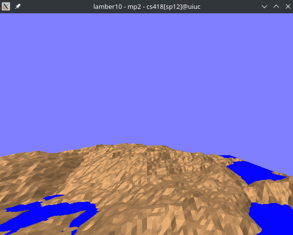

## Intro
This is a basic flight simulator written in C++ using OpenGL for the [introductory computer graphics class (CS 418) at University of Illinois](http://graphics.cs.illinois.edu). Consequently, this code was originally written sometime in the spring of 2012; I've merely cleaned it up a little.

## Instructions
To build on OS X or Linux, simply run `make` and execute with `./flightsim`

To play, you can use either the `arrow keys` or `WASD`.  
The inundation levels can be changed with the `+` and `-` keys.  
The poly size can be increased with `f` and decreased with `c`.  

To exit, type `C-c` in your terminal.

You can remove the object files etc by running `make clean`.

### Troubleshooting
If you have trouble compiling this on Arch Linux,   
`sudo pacman -S mesa glfw-x11 glew`
